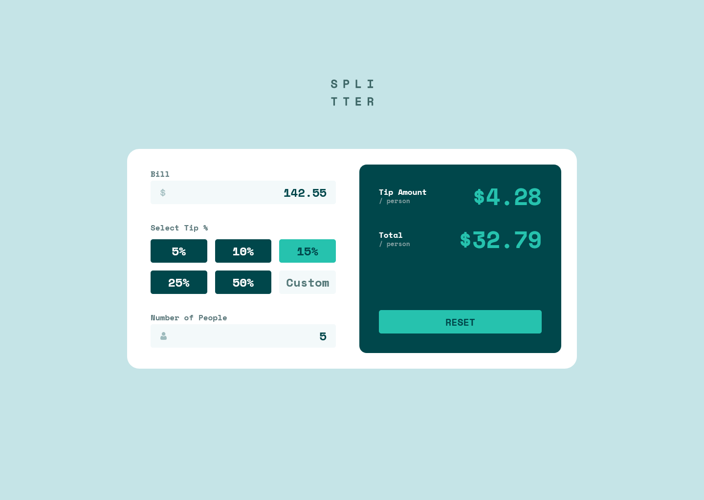

# Frontend Mentor - Tip calculator app solution

This is a solution to the [Tip calculator app challenge on Frontend Mentor](https://www.frontendmentor.io/challenges/tip-calculator-app-ugJNGbJUX). Frontend Mentor challenges help you improve your coding skills by building realistic projects.

### Screenshot

### Links

- Solution URL: [Solution URL here](https://github.com/NDK1195/tip-calculator-app)
- Live Site URL: [Live site URL here](https://tip-calculator-app-gamma-ruby.vercel.app/)

### Built with

- React
- Tailwind CSS
